## Writeup RE - Pr4nks (CSCV 2025)

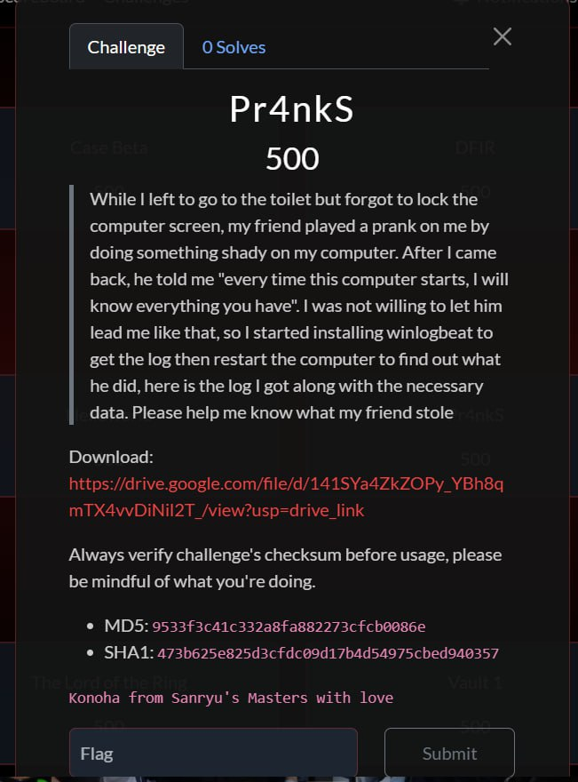

Vừa qua hết giải SV ANM mình có làm qua một bài trong giải của author Konoha. Cũng lâu rồi mình mới quay lại làm RE nên làm cũng chậm. Theo đánh giá của mình cũng như chia sẻ của author thì challenge này cũng chưa thực sự dùng hết "sức mạnh" của author và cũng không khó cho ae tham gia RE năm nay. Vì vậy mình sẽ chia sẻ qua cách làm và một số điểm hay ho mà author đã chia sẻ cho mình về ý tưởng làm đề.

#### Overview 

Đề bài cho 3 file để phân tích:

Theo suy đoán ban đầu của mình dựa trên tên các file thì:

- log.json : chứa event log khi mã độc chạy.
- process_creation.csv : chứa danh sách  tiến trình hiện tại trên hệ thống tại thời điểm bắt đầu thực hiện điều tra số.
- file .pcapng : chứa traffic giao tiếp mạng của mã độc.

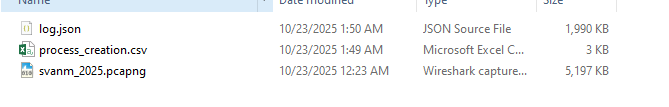

#### Phân tích Process_creation.csv

;)) với thói quen đặt tên process hay có chữ update để giả mạo các tiến trình cập nhật trên windows, mình đã search thấy một số process đáng ngờ :

`"C:\Users\konoha\AppData\Local\Temp\windows_update.bin.exe",`

`"C:\Users\konoha\AppData\Roaming\check_windows_update.exe",`

Hai process này đều được chạy từ %Temp% và %appdata% những thư mục ưu thích mà malware hay lựa chọn.

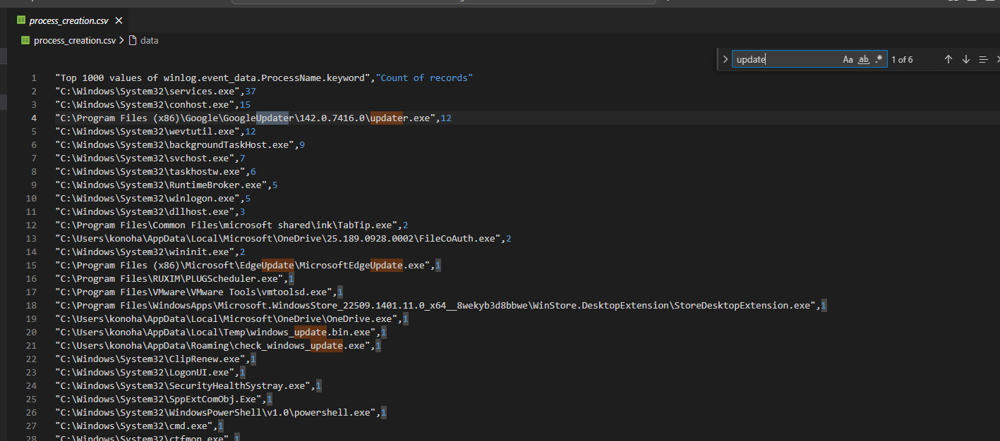

#### Phân tích Log.json

File log.json có thể là log của hệ thống giám sát nào đó, ở đây mình thấy có thể author dùng **winlogbeat** của **Elastic Beat** để theo dõi.

Thực hiện tìm kiếm với tên process khả nghi "**check_windows_update.exe**" rất nhanh chóng mình đã thấy hành vi quen thuộc của các mã độc: Thực thi mã Powershell và một phần mã quan trọng đã được mã hóa bằng Base64, sau đó mới lưu ra file exe để thực thi. Việc lợi dụng các phần mềm có sẵn trên Windows không phải mới nhưng vẫn rất hiệu quả khi triển khai mã độc :)) nếu các bạn theo dõi thì trong năm qua có vô số báo cáo các cuộc tấn công mã độc bằng thủ đoạn ClickFix (lừa người dùng copy và thực thi trực tiếp mã Powershell trên máy tính nạn nhân).

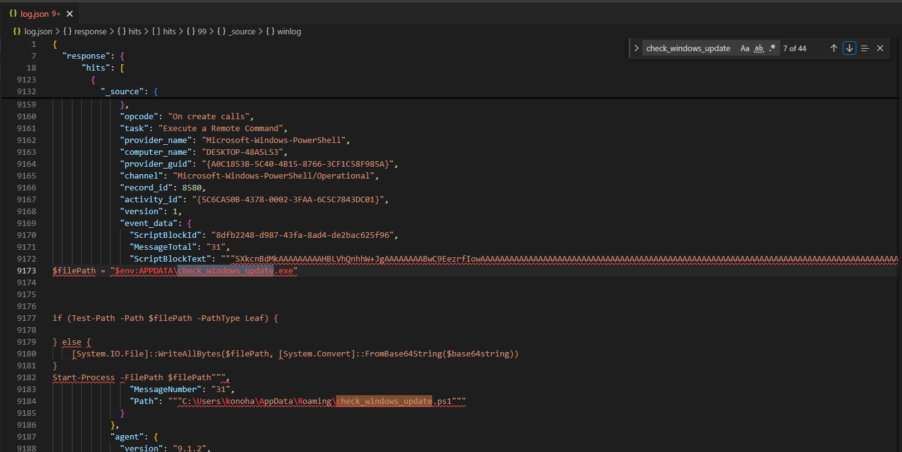

Ta có thể thấy mỗi khối event log đang chứa một đoạn mã powershell trong key "**ScriptBlockText**" và có  key "**MessageTotal**" để xác định thứ tự gói tin

;)) Ở đây mình thực hiện copy tay các đoạn log chứa mã powershell ra file .json khác để tiện xử lý (không biết các coder tay to có phương pháp nào xử lý nhanh gọn khác không). 

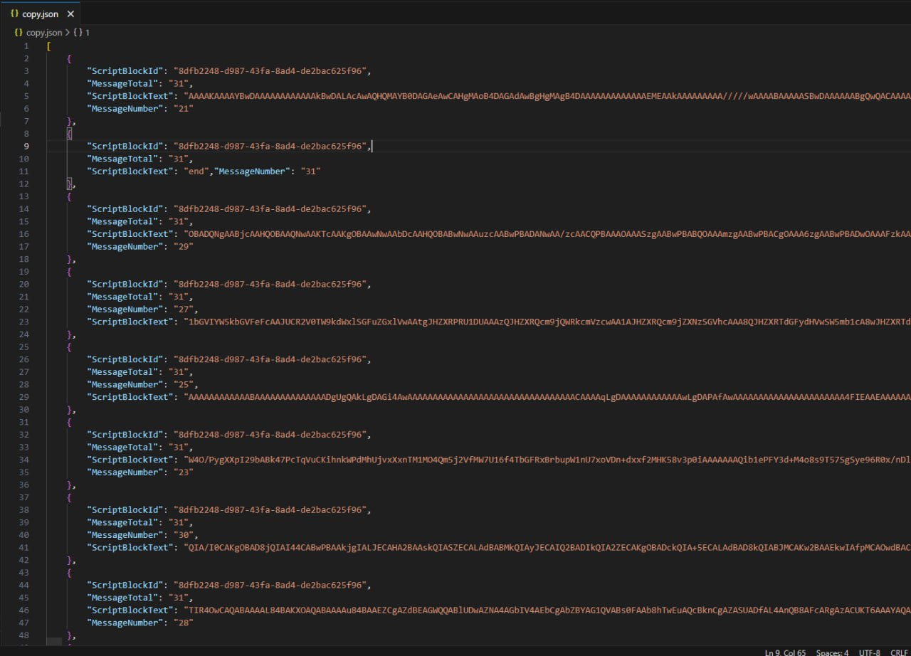

Để từ đó khôi phục được đoạn Base64 chứa code file exe và tiếp tục RE.

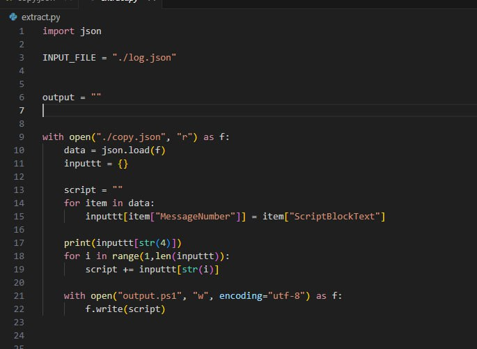

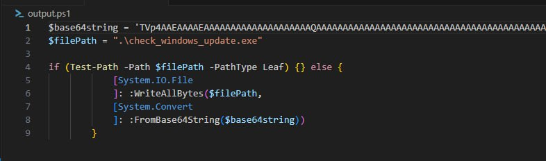

#### Phân tích Pcapng

Sử dụng lọc HTTP để xem qua ta có thể thấy một số traffic bất thường với các endpoint /**get_latest_version** /**download_update** . 

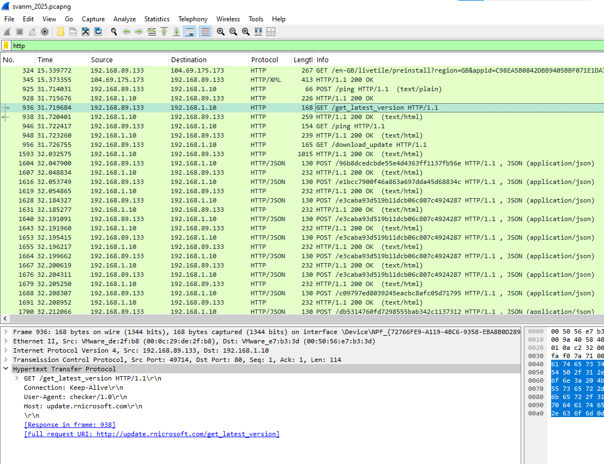

Hơn nữa, author cũng khéo léo lồng ghép một trick khá hay mà một số nhóm mã độc sử dụng trong phishing ;))

http://update.rnicrosoft.com/get_latest_version

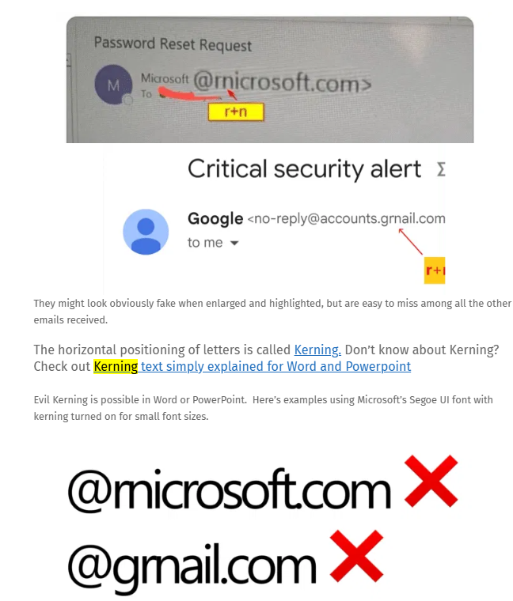

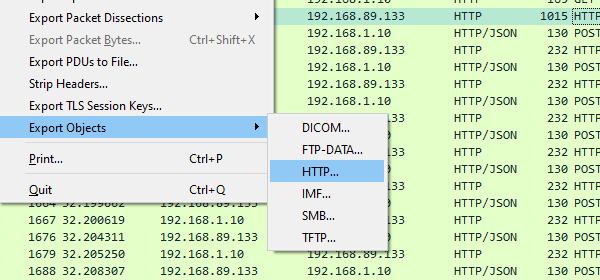

sử dụng lọc theo object http ta quan sát thấy:

- endpoint **/download_update** : đang nhận dữ liệu có thể ở dạng Base64

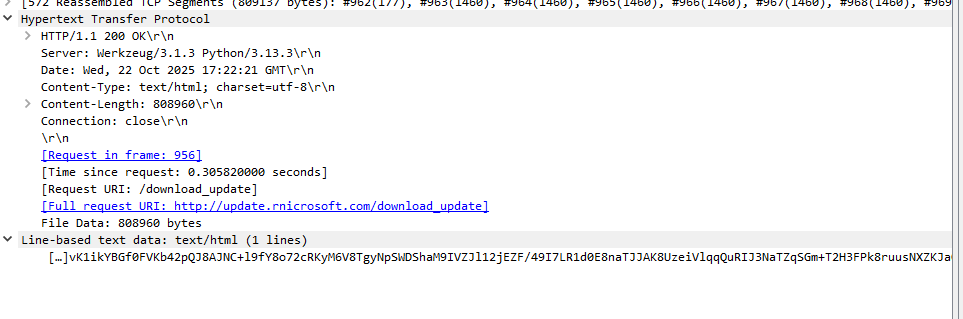

- endpoint **/get_latest_version** : nhận về một đoạn gồm 16bytes chuỗi giá trị hex

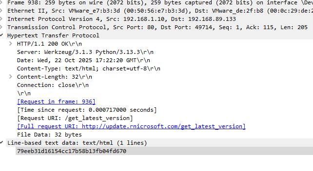

- các endpoint là mã hex : Thực hiện nhận về 2 bytes giá trị hex (chưa rõ mục đích)

  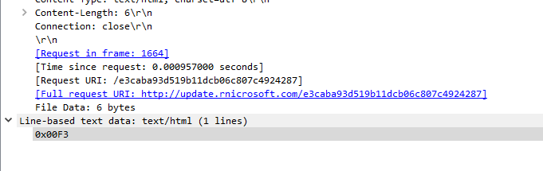

#### Phân tích file Update.exe

Sử dụng IDA để decompile mã nguồn của file ta có thể thấy một số chuỗi khi thực hiện phân tích file .pcap 

và dự đoán được về hành vi mã độc đang thực hiện trong hàm main: Ping về máy chủ C2

và http://update.rnicrosoft.com là địa chỉ của máy chủ C2.

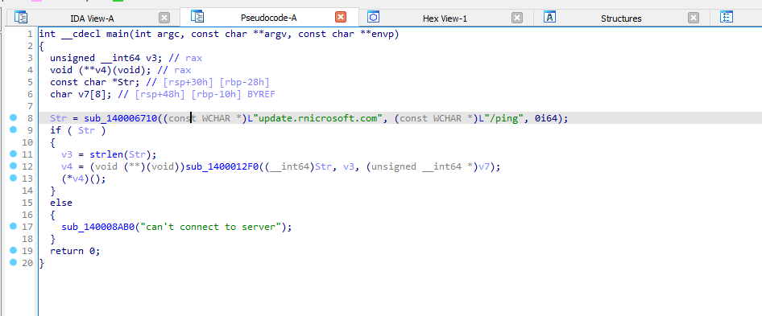

Kiểm tra qua danh sách string có thể tìm thấy các endpoint khác được liệt kê ở đây

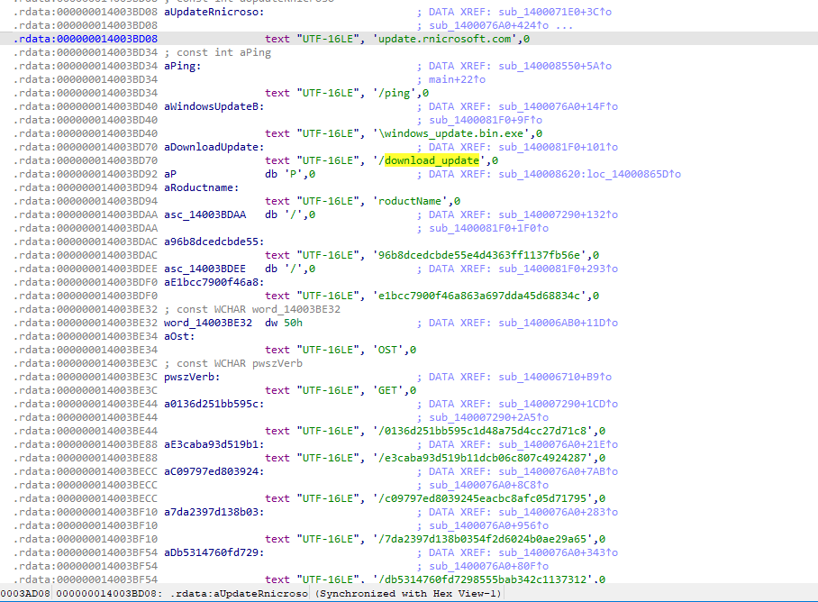

Tiếp tục sử dụng chức năng xref của IDA để tìm tới các hàm chức năng.

Dựa vào thứ tự gửi traffic ta tìm đến hàm download_update đầu tiên, tại đây chương trình tiến hành download một file exe khác và theo dự đoán thì file này sẽ là file thực thi chứa chức năng chính của mã độc.

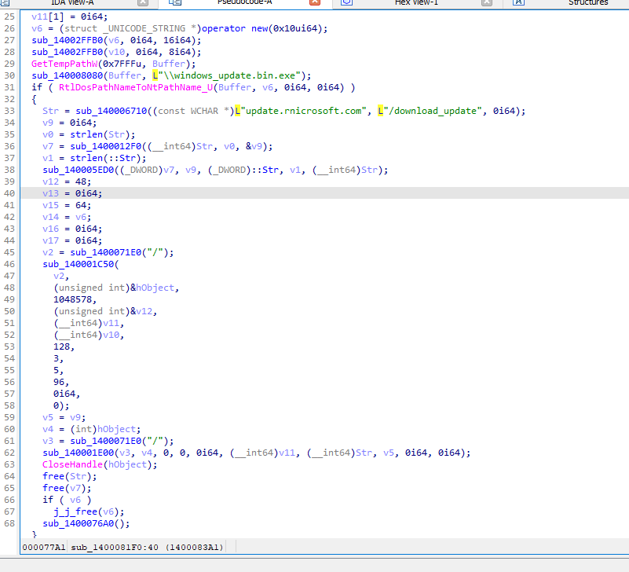

Đoạn này có một chút anti-diassembly ae tự xử lý nhé.

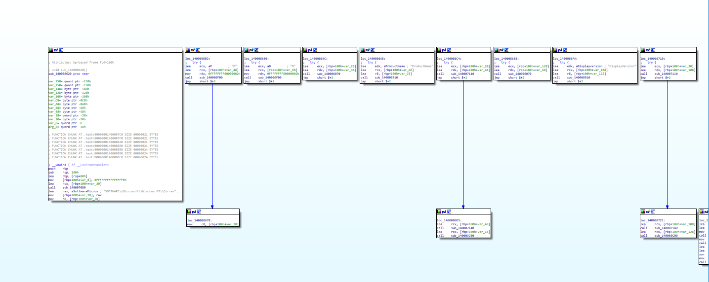

Ta tập trung vào hàm xử lý chính của exe hiện tại

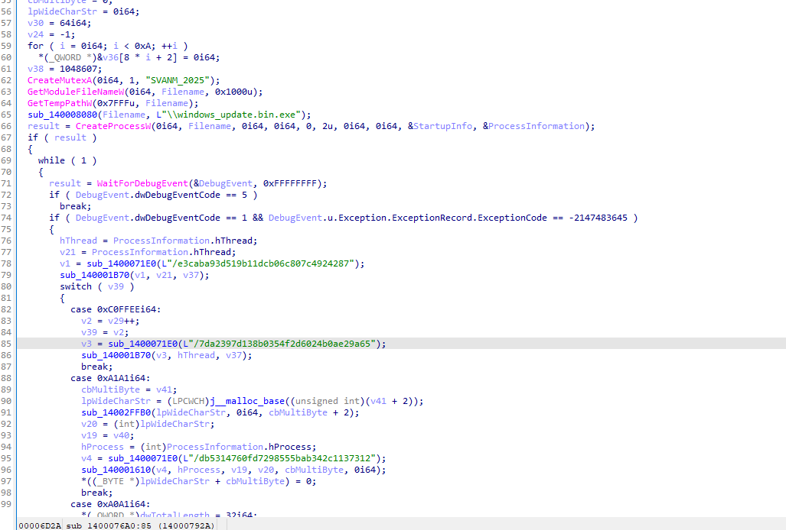

CreateMutexA(0i64, 1, "SVANM_2025") : tạo mutex để tránh có nhiều tiến trình mã độc chạy cùng lúc.

Thấy rằng sau khi download file `windows_update.bin.exe` từ C2, malware tiến hành tạo tiến trình mới để chạy file **windows_update.bin.exe**  `CREATE_SUSPENDED | DEBUG_PROCESS` (`2u` là flag `CREATE_SUSPENDED` hoặc `DEBUG_PROCESS`) cho thấy tiến trình **bị tạm dừng để debug**, thường dùng để **inject code / hook**.

Trong vòng lặp While:

**WaitForDebugEvent**: chờ debug event

`dwDebugEventCode == 5`: tiến trình kết thúc.

`dwDebugEventCode == 1 && ExceptionCode == 0xC000001B`:
 → xử lý **exception breakpoint / vectored exception**.

`ContinueDebugEvent` tiếp tục tiến trình.

- Tìm kiếm hằng số ta có thể tìm thấy bẳng mã hóa của mã hóa Base64

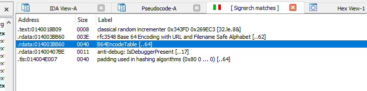

trace ngược lại để tìm và đặt tên cho hàm mã hóa base64 nghi ngờ

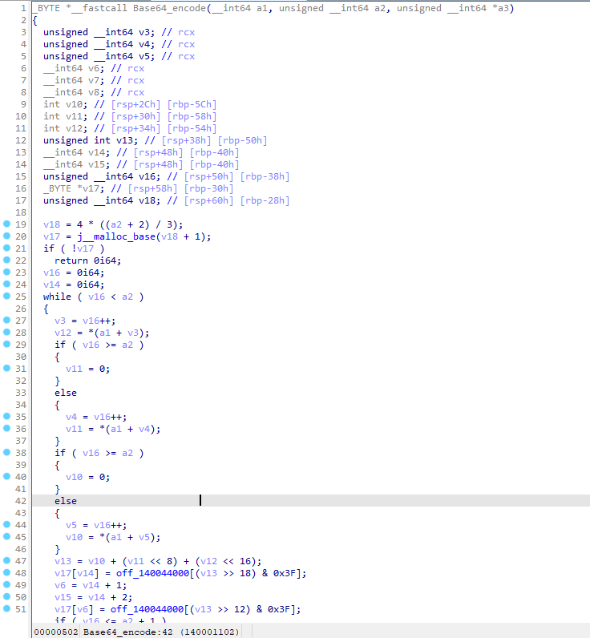

Và hàm này được gọi trong **Case 0xA0A1**: khi mã độc gửi tới endpoint /api/version

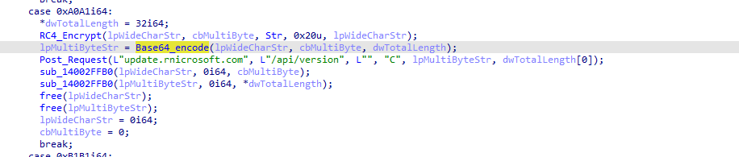

Xem xét các hàm lân cận ta cũng dễ dàng tìm thấy hàm mã hóa RC4

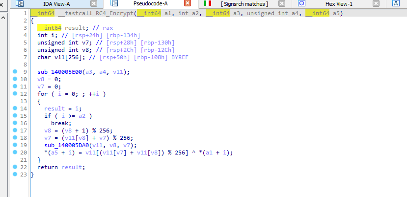

Vậy là có thể đưa ra dự đoán đây là hàm mã hóa dữ liệu bằng RC4 + base64 và sau đó gửi đi. Khớp với phân tích file .pcap ở trên.

> Ta có thể dự đoán về ý tưởng của tác giả về cách giấu file: Gửi nhận flag đã mã hóa trên các traffic HTTP, và flag có thể được lưu ở dạng hình ảnh hoặc plain text vì vậy cần chú ý về magic number khi giải mã.

Vì sử dụng mã hóa đối xứng RC4 vì vậy ta cần đi tìm key để giải mã và có thể cần phân tích cách mà mã độc trao đổi khóa trên đường truyền.

Dựa vào phân tích hàm mã hóa RC4 ta có thể tìm thấy biến để lưu key là **Str**

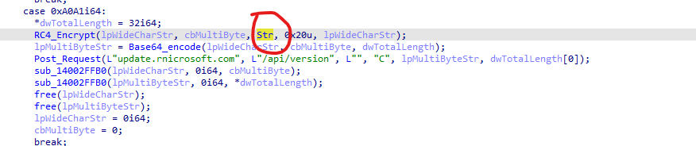

Tìm kiếm các vị trí gắn biến cho key RC4 ta thấy mã độc thực hiện hành động lưu ở hai Case đều có endpoint là **/get_latest_version**

Mã độc sẽ gửi GET requet tới endpoint **/get_latest_version** để lấy key RC4 mã hóa.

Sau đó dùng key để mã hóa nội dung gửi đi và gửi qua POST  **/api/version**

Thử thực hiện suy đoán khi dùng key để giải mã nội dung gửi đi:

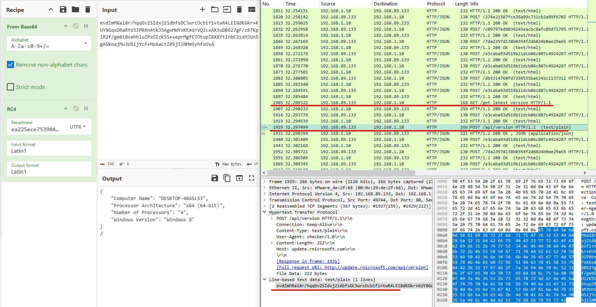

Giải mã được nội dung gửi đi rồi. Giải mã một số gói tin sẽ thấy được đường dẫn của file ảnh gửi đi

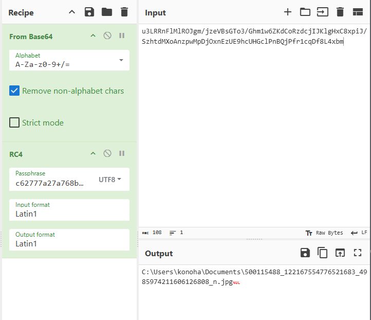

Nhưng không phải gói tin nào cũng có thể sử dụng kiểu giải mã bằng cách sử dụng key khi GET để mã hóa nội dung gửi đi. 

Và có 1 điểm bất thường là ngoài dùng GET như bình thường  thì ở đây mã độc còn thực hiện cả POST trước khi mã hóa dữ liệu (khi POST thì gửi đi một key mã hóa), nội dung trong /api/version thì rất dài và nhiều 

> => Mã hóa và gửi đi ảnh => ảnh chứa flag.

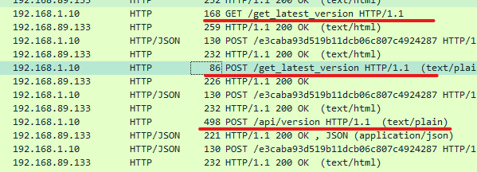

- Xem xét lại giả mã của hàm thì ta thấy mã độc đã tự sinh ra một chuỗi khóa, sau đó gửi về server và dùng khóa đó để Xor với khóa đã lưu trước đó (Khi GET)

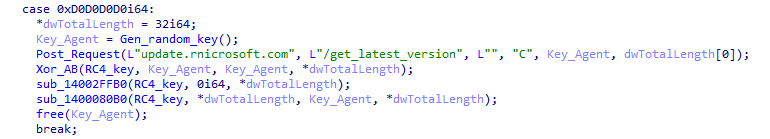

Mình tạo ra một rule mới để dễ lọc và tìm kiếm các gói tin của hai endpoint chính nói trên.

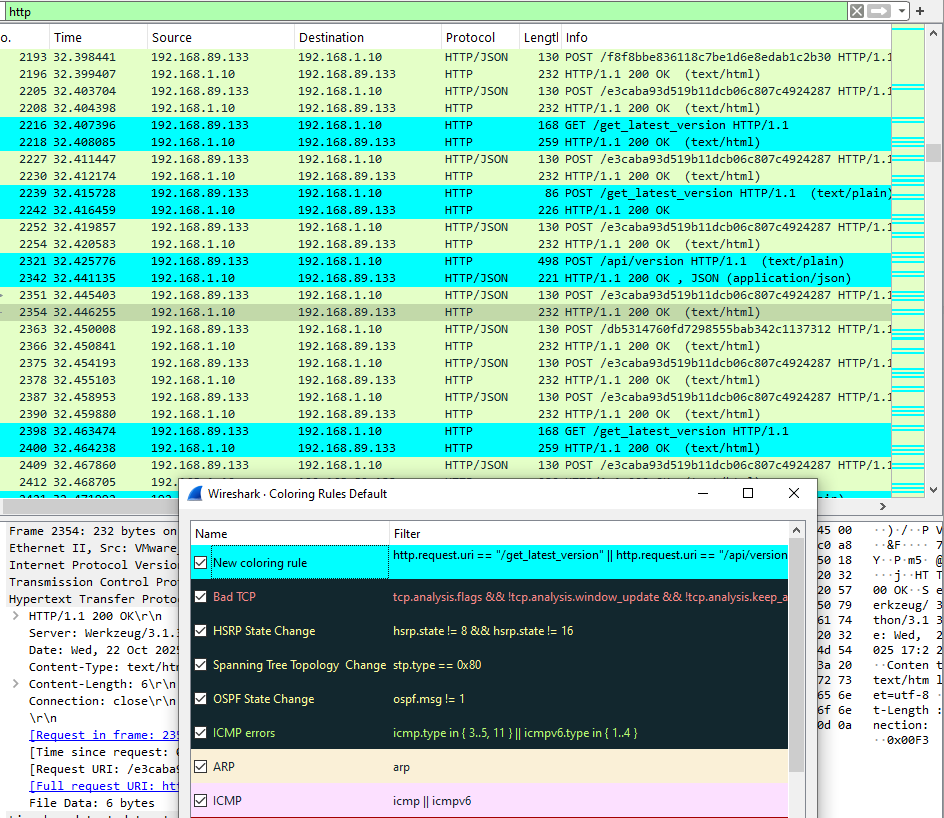

- Tiến hành giải mã thử nào. Xor để lấy khóa mới. :))

  > Lưu ý là xor từng kí tự theo string. Lúc đầu mình đã bị nhầm khi xor dưới dạng số hexa

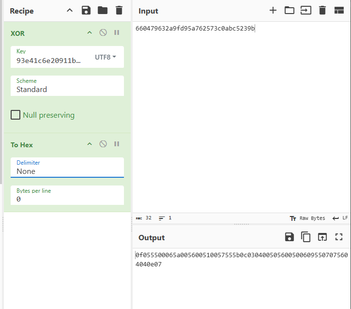

- Và khi giải mã thì nhớ đặt kiểu key là hex nhé ;))

  Quan sát ta đã thấy những magic number của file ảnh JPEG. Vậy là đúng hướng rồi!

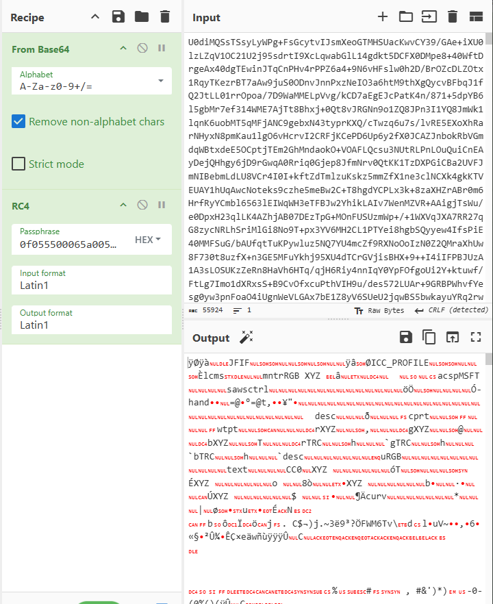

Trong chall, tác giả gửi rất nhiều ảnh và có cả flag của những năm trước, chắc là để ae hoài niệm về những kỷ niệm về những giải SVATTT trước đây ;))

Sau khi thử một lúc sẽ thấy được flag thật thoai!

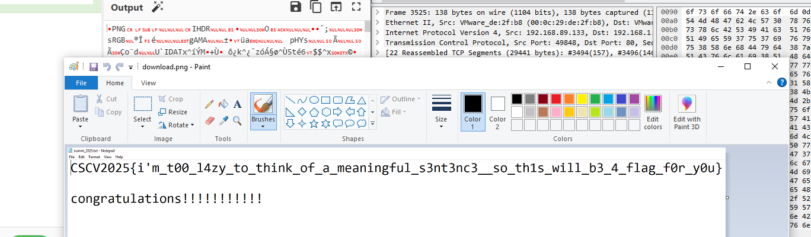

rất hay và vừa sức cho mọi lứa tuổi :v 

#### Phân tích thêm về chall

Sau khi trao đổi với author, mình cũng đã giải đáp được thắc mắc về những request tới các chuỗi hex như ở hình dưới. Tưởng chừng như chỉ là gửi 2 bytes ngẫu nhiên nào đó để duy trì kết nối hoặc gây rối cho traffic :> nhưng không phải, ở đây author sử dụng kỹ thuật rất hay. Đó là kỹ thuật **Direct Syscall.**

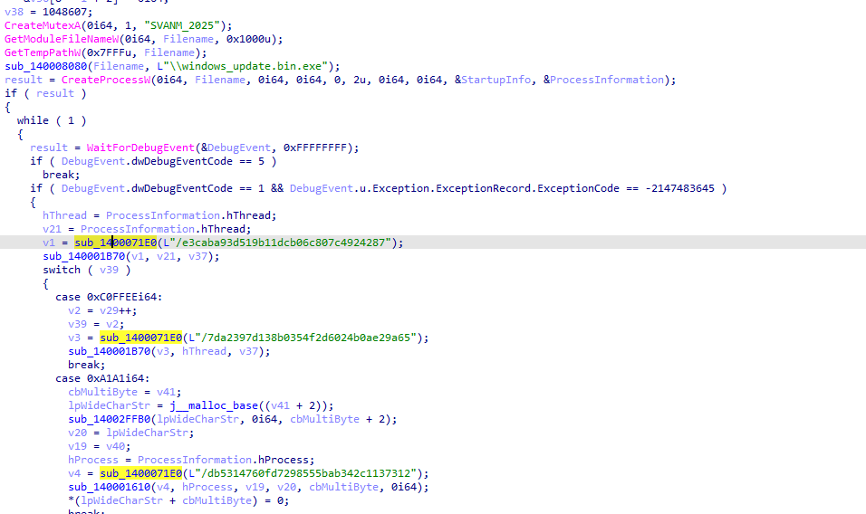

Tùy từng phiên bản windows mà các hàm này sẽ gọi về server để lấy được mã syscall tương ứng để thực hiện các hành vi một cách trực tiếp, không cần thông qua gọi Windows API thông thường.

https://viblo.asia/p/bypass-av-hook-direct-syscall-EvbLb5AvJnk - ae có thể đọc thêm bài này để hiểu thêm về Direct Syscall

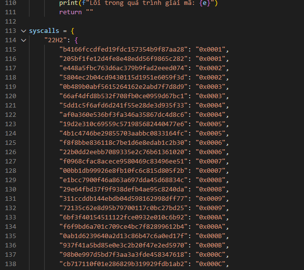

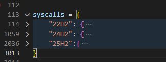

Một ví dụ về kỹ thuật gọi Syscall trực tiếp:

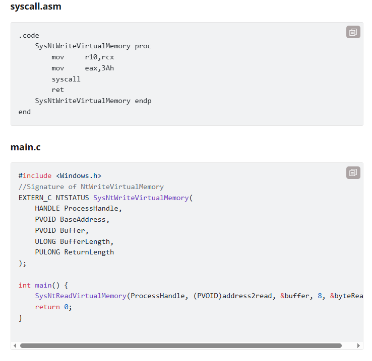

Kỹ thuật này giúp mã độc tránh được các biện pháp giám sát dựa trên hành vi như khi sử dụng Windows API.

(Đang viết tiếp ... :v)

